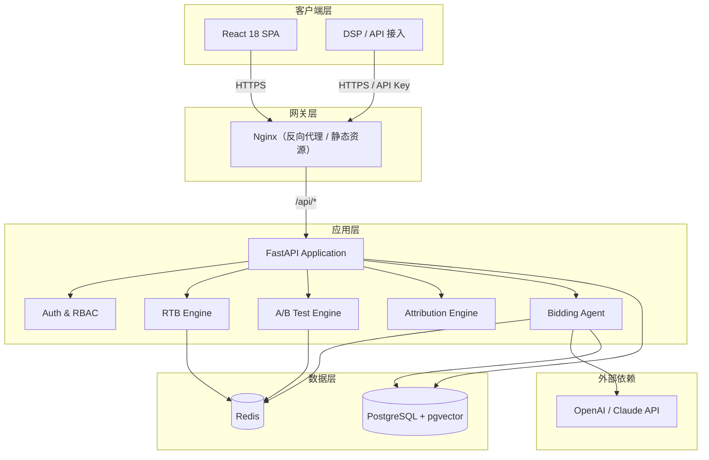
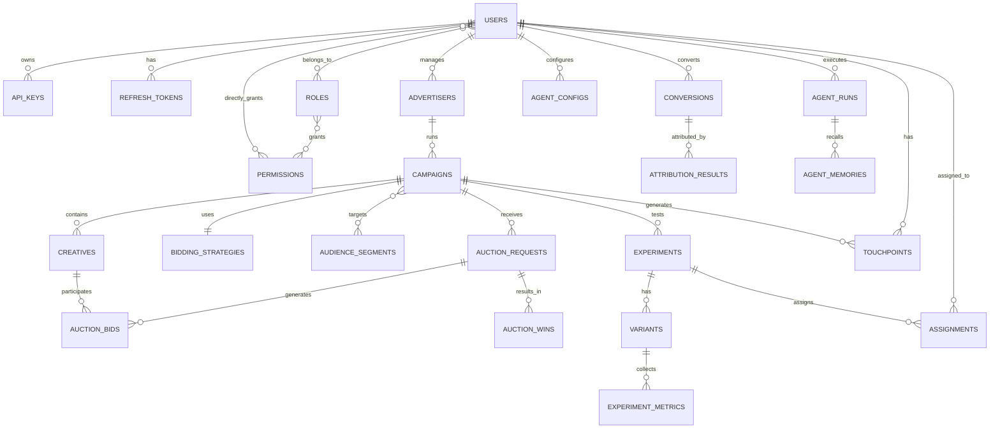
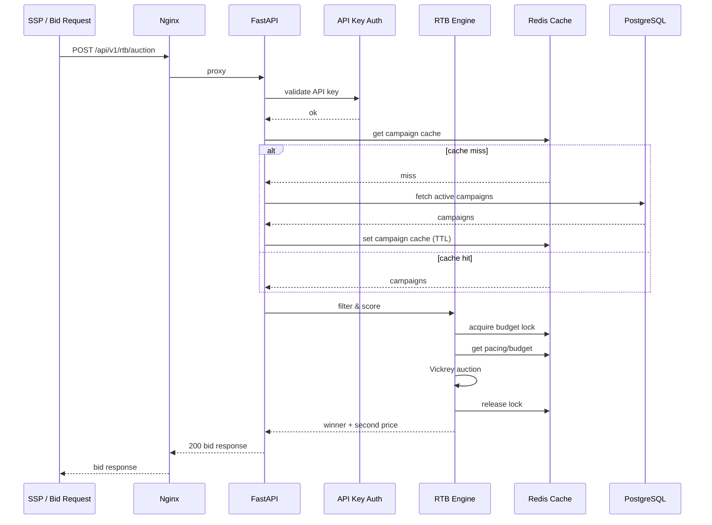
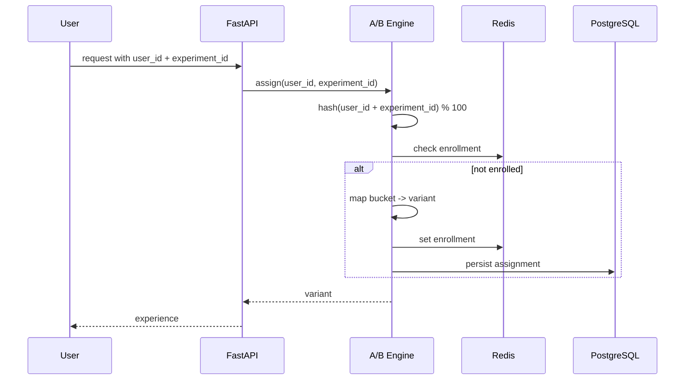
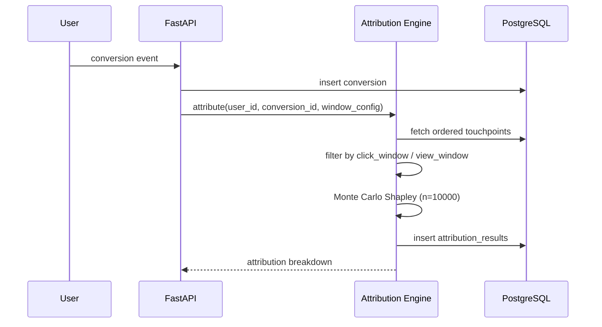
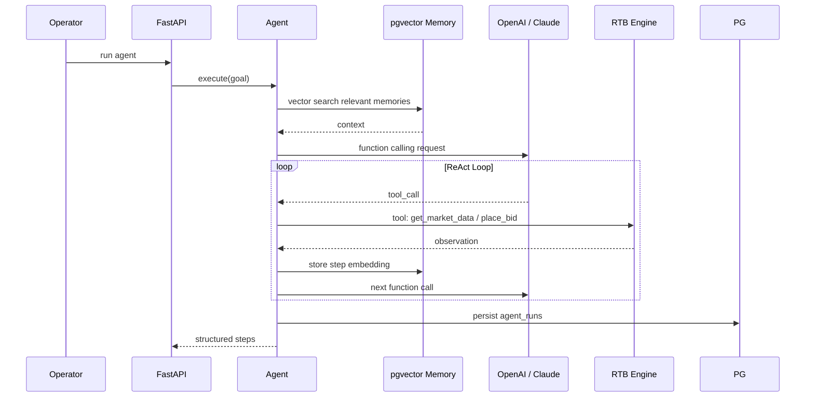
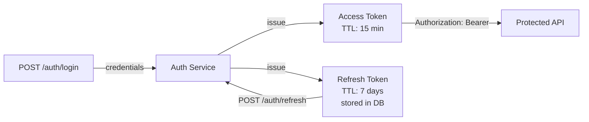
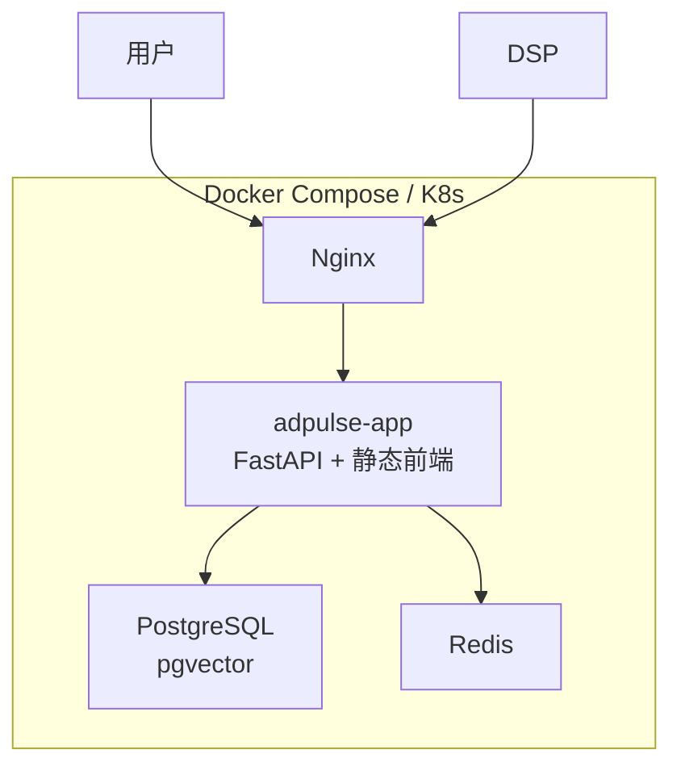

# AdPulse 架构设计文档

> 版本：v1.0.0
> 状态：生产级程序化广告投放平台（Programmatic Advertising Platform）

## 1. 设计目标

AdPulse 是一个面向 DSP/SSP 生态的实时竞价（RTB）广告投放平台，核心能力包括：

- **RTB 引擎**：在 100ms（p99）内完成竞价决策，支持 Second-Price Auction（Vickrey）。
- **A/B 实验引擎**：一致性哈希分流、双样本 t 检验 / Mann-Whitney U 检验、power analysis、MDE 计算。
- **归因引擎**：有序 touchpoint 记录、可配置归因窗口、Monte Carlo Shapley Value 近似。
- **AI Bidding Agent**：基于真实 LLM 的工具调用（function calling）与 pgvector 长期记忆。
- **安全与治理**：JWT Access/Refresh、RBAC、API Key、CORS 白名单、审计日志。

---

## 2. 技术栈

| 层级 | 技术 |
|------|------|
| 后端框架 | Python 3.11+、FastAPI、Pydantic v2 |
| 数据库 | PostgreSQL 15+、SQLAlchemy 2.0（async）、Alembic 迁移 |
| 缓存/队列/锁 | Redis 7+（redis-py async、连接池、分布式锁） |
| 向量存储 | pgvector（PostgreSQL 扩展） |
| 统计/ML | SciPy、NumPy、statsmodels |
| LLM | OpenAI / Anthropic Claude（真实 API，function calling） |
| 测试 | pytest、pytest-asyncio、httpx、testcontainers |
| 前端 | React 18、TypeScript、Vite、Zustand、TanStack Query |
| 部署 | Docker（multi-stage）、docker-compose、GitHub Actions |
| 代码质量 | black、isort、flake8、mypy、pre-commit |

---

## 3. 系统架构概览



---

## 4. 领域模型与 ER 图

### 4.1 核心实体

| 实体 | 说明 |
|------|------|
| `users` | 平台用户，支持 RBAC 角色 |
| `roles` / `permissions` / `user_permissions` | RBAC 角色与权限 |
| `api_keys` | DSP 接入用的 API Key |
| `refresh_tokens` | JWT Refresh Token 持久化 |
| `advertisers` | 广告主 |
| `campaigns` | 广告投放计划 |
| `creatives` | 创意素材 |
| `audience_segments` | 人群包 |
| `bidding_strategies` | 出价策略 |
| `auction_requests` | 竞价请求日志 |
| `auction_bids` | 出价记录 |
| `auction_wins` | 竞价胜出记录 |
| `experiments` | A/B 实验 |
| `variants` | 实验变体 |
| `assignments` | 用户-实验分配 |
| `experiment_metrics` | 实验指标采集 |
| `conversions` | 转化事件 |
| `touchpoints` | 归因 touchpoint（有序） |
| `attribution_results` | 归因结果 |
| `agent_configs` | Agent 配置 |
| `agent_memories` | 向量记忆（pgvector） |
| `agent_runs` | Agent 执行记录 |

### 4.2 ER 图



---

## 5. 核心数据流

### 5.1 RTB 竞价流（目标 p99 < 100ms）



**关键设计点**：

- 所有竞价相关元数据预热到 Redis，不直接查 PostgreSQL。
- 预算扣减使用 Redis 分布式锁（Redlock / Lua 原子脚本）。
- 异步落库（auction_requests、bids、wins）通过后台任务写入 PostgreSQL。
- Second-Price Auction：winner pays `max(second_highest_bid, reserve_price)`。

### 5.2 A/B 实验分流流



### 5.3 归因引擎流



### 5.4 AI Bidding Agent 流



---

## 6. 认证授权架构

### 6.1 JWT 双令牌



### 6.2 RBAC 模型

| 角色 | 权限示例 |
|------|----------|
| `admin` | 用户管理、全局配置、所有资源读写 |
| `advertiser` | 管理自有 campaign、creative、查看报表 |
| `viewer` | 只读查看 dashboard、报表 |

权限在数据库中以 `permissions.code` 形式存储（如 `campaign:read`、`campaign:write`），通过依赖注入在每个端点校验。

### 6.3 API Key

- `api_keys` 表存储 `key_hash`、`prefix`、`scopes`、`rate_limit`。
- RTB 接入端点强制 API Key 认证。
- Key 只在创建时明文返回一次。

### 6.4 CORS

- 配置文件/环境变量维护白名单列表。
- 禁止 `allow_origins=["*"]`。
- 生产环境仅开放 `https://app.adpulse.example` 等指定域名。

---

## 7. 数据库与迁移

- **数据库**：PostgreSQL 15+，启用 `pgvector` 扩展。
- **ORM**：SQLAlchemy 2.0，使用 `Mapped` / `mapped_column` 类型注解。
- **迁移**：Alembic 手动管理迁移脚本，**禁止** `Base.metadata.create_all` 自动建表。
- **主键**：全部使用 `uuid.UUID`，`default=uuid.uuid4`。
- **时间戳**：统一使用 `datetime.utcnow`。
- **连接池**：异步引擎配置 `pool_size`、`max_overflow`、`pool_recycle`。

---

## 8. 缓存与并发

### 8.1 Redis 用途

| 用途 | Key 设计 | 说明 |
|------|----------|------|
| 活动 campaign 缓存 | `campaigns:active` | Hash / JSON，TTL 60s |
| 预算余额 | `campaign:{id}:budget` | 原子扣减 |
| 竞价锁 | `lock:campaign:{id}` | Redlock |
| 实验分配 | `exp:{experiment_id}:user:{user_id}` | 永久或实验周期内 |
| 速率限制 | `rate:{api_key_prefix}` | Sliding window |

### 8.2 asyncio 连接池

- PostgreSQL 使用 `asyncpg` + SQLAlchemy async。
- Redis 使用 `redis.asyncio.Redis` 连接池。
- 所有 I/O 密集型操作均为 async/await。

---

## 9. 部署架构



### 9.1 容器清单

| 服务 | 镜像 | 说明 |
|------|------|------|
| `app` | 多阶段 Dockerfile | FastAPI + 前端构建产物 |
| `postgres` | `pgvector/pgvector:pg15` | 关系库 + 向量扩展 |
| `redis` | `redis:7-alpine` | 缓存、锁、限流 |
| `nginx` | `nginx:alpine` | 反向代理、静态资源 |

### 9.2 CI/CD

- GitHub Actions 工作流：lint（black/isort/flake8/mypy）、test（pytest + testcontainers）、build image。
- 合并前必须全部通过。
- 多阶段 Dockerfile 减小最终镜像体积。

---

## 10. 关键算法说明

### 10.1 Second-Price Auction

```
winner = argmax(bids)
second_price = max(second_highest_bid, reserve_price)
winner_pays = second_price
```

- 若最高出价低于 reserve price，则无胜出者。
- 所有价格以 per-impression 存储，CPM 展示时乘以 1000。

### 10.2 A/B 测试统计

- **分流**：`bucket = hash(user_id + experiment_id) % 100`，保证同一用户始终落入同一桶。
- **检验**：双样本 t 检验（均值差异）、Mann-Whitney U 检验（非参数）。
- **输出**：p-value、置信区间、power、MDE。
- **样本量**：基于目标 power / significance / MDE 进行 power analysis。

### 10.3 Shapley Value 近似

- 对每次转化，收集窗口期内的有序 touchpoint 序列。
- 使用 Monte Carlo 排列采样 `n=10000` 次估计 Shapley Value。
- 结果按 campaign / creative 聚合。

---

## 11. 非功能需求

| 指标 | 目标 |
|------|------|
| RTB p99 延迟 | < 100ms |
| 核心模块测试覆盖率 | ≥ 85% |
| 数据库迁移 | 100% Alembic 管理 |
| 认证端点 | JWT + RBAC + API Key 全覆盖 |
| CORS | 严格白名单 |

---

## 12. 环境变量（摘要）

详见项目根目录 `.env.example`，主要包含：

- `DATABASE_URL`
- `REDIS_URL`
- `SECRET_KEY`、`ALGORITHM`、`ACCESS_TOKEN_EXPIRE_MINUTES`、`REFRESH_TOKEN_EXPIRE_DAYS`
- `OPENAI_API_KEY` / `ANTHROPIC_API_KEY`
- `CORS_ORIGINS`（逗号分隔）
- `LOG_LEVEL`

---

## 13. 目录结构（目标）

```
adpulse/
├── docs/
│   └── architecture.md
├── backend/
│   ├── alembic/
│   │   ├── versions/
│   │   └── env.py
│   ├── app/
│   │   ├── main.py
│   │   ├── core/
│   │   │   ├── config.py
│   │   │   ├── database.py
│   │   │   ├── security.py
│   │   │   ├── redis.py
│   │   │   ├── exceptions.py
│   │   │   └── response.py
│   │   ├── models/
│   │   │   └── __init__.py
│   │   ├── schemas/
│   │   ├── api/
│   │   │   ├── auth.py
│   │   │   ├── rtb.py
│   │   │   ├── abtest.py
│   │   │   ├── attribution.py
│   │   │   ├── agent.py
│   │   │   └── dashboard.py
│   │   └── services/
│   │       ├── rtb_engine.py
│   │       ├── ab_test_engine.py
│   │       ├── attribution_engine.py
│   │       ├── bidding_agent.py
│   │       └── auth_service.py
│   ├── tests/
│   │   ├── conftest.py
│   │   ├── unit/
│   │   ├── integration/
│   │   └── perf/
│   ├── Dockerfile
│   ├── requirements.txt
│   └── pytest.ini
├── frontend/
│   ├── src/
│   │   ├── features/
│   │   │   ├── auth/
│   │   │   ├── rtb/
│   │   │   ├── abtest/
│   │   │   ├── attribution/
│   │   │   └── agent/
│   │   ├── components/
│   │   ├── hooks/
│   │   ├── stores/
│   │   ├── utils/
│   │   └── App.tsx
│   ├── Dockerfile
│   └── package.json
├── docker-compose.yml
├── .github/
│   └── workflows/
│       └── ci.yml
├── .env.example
├── README.md
└── AGENTS.md
```

---

## 14. 变更日志

| 日期 | 版本 | 说明 |
|------|------|------|
| 2026-07-09 | 1.0.0 | 初始架构设计，明确 PostgreSQL + Redis + pgvector 技术栈 |
